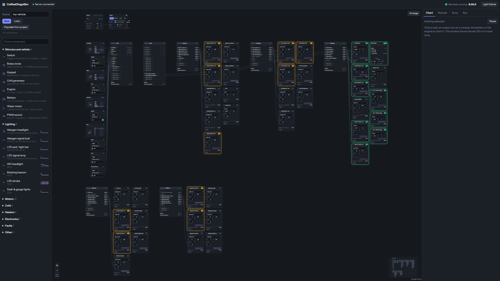

[](https://github.com/Coffee0297/CoffeeDingoFW/releases)
[](https://github.com/corygrant/dingoFW)
[](https://corygrant.github.io/dingoPDM/)

# CoffeeDingoFW

Firmware for the **dingoPDM v7**, **dingoPDM-Max v1** and **CANBoard v2**: a fork of
[corygrant/dingoFW](https://github.com/corygrant/dingoFW) that adds firmware updates over CAN, embedded Lua,
PWM inputs, timers, lookup tables, an on-board trip log and a set of CAN robustness fixes. The dingoPDM is an
Infineon Profet based power distribution module; the CANBoard adds analog/digital inputs and four low-side
outputs to the same CAN bus. ChibiOS RT on an STM32F446 (PDMs) or STM32F303 (CANBoard).

It is configured with **[CoffeeDingoConfig](https://github.com/Coffee0297/CoffeeDingoConfig)** (≥ v0.8.0 for
v5.5.108) and can be run off the car, unchanged, in **[CoffeeDingoSim](https://github.com/Coffee0297/CoffeeDingoSim)**:
the screenshot below is this firmware running seven modules of a whole vehicle on a PC.



**Latest release: [v5.5.108](https://github.com/Coffee0297/CoffeeDingoFW/releases)** (`CONFIG_VERSION` 0x0011),
see the [CHANGELOG](CHANGELOG.md). Flashing it over a different config version resets the module's saved
settings to defaults: deploy your project again from dingoConfig afterwards.

## Compared with the original dingoFW

The fork branched from upstream `master` at `06cb9e3` (2026-05-16). Upstream issue numbers (#52, #61) were
design discussions there, not merged code. ✅ = present, ❌ = absent.

| Feature | Original | This fork | Notes |
|---|---|---|---|
| Boards dingoPDM v7, dingoPDM-Max v1, CANBoard v2 | ✅ | ✅ | |
| PT-DPDM4 board, NeoPixel LEDs | ✅ | ❌ | Added upstream after the fork point |
| Firmware update over USB DFU | ✅ | ✅ | BOOT0 or the software trigger |
| **Firmware update over CAN** (OpenBLT XCP bootloader) | ❌ | ✅ | Bootloader installed once (SWD/DFU), then every app update over CAN from dingoConfig |
| **Embedded Lua** (PDMs) with CAN tx/rx, timers, 32 output slots | ❌ | ✅ | Lua 5.5, `lua/`; upload, read-back and error read-back over CAN |
| **PWM input** on digital inputs (duty %, Hz, glitch filter) | ❌ | ✅ | v5.5.108; frequency capped per board from its input circuit |
| Analog: calibrated multi-position switch (≤ 10 positions), linear sensor scaling | ❌ | ✅ | Replaces the uniform offset/step rotary |
| Outputs: current limit, inrush, reset modes, PWM, soft start | ✅ | ✅ | |
| PWM output frequency from a signal, duty slew | ❌ | ✅ | |
| PWM on the CANBoard's DO1–DO4 | ❌ | ✅ | One timer per output |
| Warn limit / open-load detection | ❌ | ✅ | Report only; the output keeps running |
| **Trip log** with the current waveform around each trip | ❌ | ✅ | Read over CAN |
| Output bench test (force on / PWM for a bounded hold) | ❌ | ✅ | |
| Conditions, counters, flashers, virtual inputs, CAN in/out, keypads, wiper, starter | ✅ | ✅ | |
| Condition hysteresis (separate release point) | ❌ | ✅ | |
| **Timers** (on-delay / off-delay / pulse) | ❌ | ✅ | |
| **Lookup tables** (up to 8×8, bilinear) | ❌ | ✅ | PDMs |
| Auto-sleep | ✅ | ✅ | |
| Force-sleep / mute-TX inputs, per-pin wake sources, outputs off on sleep | ❌ (`development` branch only) | ✅ | |
| CAN: full RX FIFO drain, 48-frame CANBoard mailbox, no-ACK retransmit back-off | ❌ | ✅ | No more frame loss on a busy bus |
| Param protocol: WriteAll, CheckCrc | ✅ | ✅ | |
| Refused single param write gets a reply | ❌ | ✅ | Upstream stays silent |
| CANBoard built as Cortex-M4F (hardware FPU, `-Os`, CCM) | ❌ | ✅ | Frees the flash for the features above |
| Host self-test, SWD batch flasher | ❌ | ✅ | `tests/host_selftest.cpp`, `flash-dingo.ps1` |

The original's unreleased `development` work since the fork point (multi-bus draft, params in their own
thread, live CAN filter updates, chunked FRAM writes) is not in this fork. The two `CONFIG_VERSION` lines are
independent (upstream 0x0006/0x0007, here 0x0011), so moving a module between the two resets its config.

## Guide

### 1. Get the firmware
Download the files for your board from the [releases](https://github.com/Coffee0297/CoffeeDingoFW/releases)
(`.bin` / `.hex` for USB or SWD, `.srec` for CAN), or build it:

```bash
# ARM GNU toolchain on PATH (arm-none-eabi-gcc 13.x). Build from bash, not cmd.exe.
make clean && make BOARD=dingopdm_v7      # or dingopdmmax_v1, canboard_v2
# -> build/<board>.bin / .hex / .elf / .srec
g++ -std=c++20 -DDINGO_HOST_TEST -I functions -I core tests/host_selftest.cpp functions/table.cpp functions/timer.cpp -o build/host_selftest && build/host_selftest
```

### 2. Flash a module
- **dingoPDM / -Max over USB:** hold BOOT0 (or use dingoConfig's *Flash over USB*), the board appears in DFU,
  dingoConfig writes the `.bin`.
- **First install of the CAN bootloader:** once per board over SWD or USB DFU (see
  [Firmware update over CAN](#firmware-update-over-can-openblt) below). A batch of blank boards:
  [`flash-dingo.ps1`](#batch-swd-flashing-flash-dingops1).
- **Every update after that, over CAN:** dingoConfig ▸ System ▸ *Flash over CAN* ▸ pick the `.srec`. No USB,
  the module stays in the car, and an interrupted update can simply be run again.

### 3. Configure it
Everything is set from dingoConfig and stored on the module (FRAM on the PDMs, a flash sector on the
CANBoard). Typical building blocks:

| You want | Build it from |
|---|---|
| A light on a switch | Digital input (or CAN input from a CANBoard) → output rule |
| A light on a multi-position knob | CANBoard analog input as a calibrated rotary → condition per position → output |
| Fan on above 90 °C, off below 85 °C | Analog input with linear scaling → condition with hysteresis → output (or PWM duty from a lookup table) |
| Indicators / hazards | Flasher, or Lua for synchronised clocks across modules |
| Fuel pump prime + run, after-run fans | Timers (pulse, off-delay) |
| Switch an output at x % of an incoming PWM signal | Digital input in PWM mode → condition on *PWM Duty* → output |
| Copy an incoming PWM to an output | Digital input in PWM mode → output with variable duty from *PWM Duty* |
| Anything else | Lua on the PDM: read any signal with `readVar`, drive outputs with `setLuaOut`, talk CAN with `txCan`/`onCanRx` |

**PWM input limits** (from the board schematics): dingoPDM inputs are 4.7 kΩ + 10 nF, good to about 1 kHz from
a driven 12 V source but only ~100 Hz from an open collector on the internal pull-up (add an external pull-up
for more); CANBoard inputs are a bare 10 kΩ, good to ~5 kHz but unfiltered, so use the glitch filter on long
harness runs.

### 4. Test before the car
Run the build in [CoffeeDingoSim](https://github.com/Coffee0297/CoffeeDingoSim) with your dingoConfig project:
the same `.elf` on a virtual bus, with bulbs, motors, switches and knobs you can operate on screen.

## Firmware update over CAN (OpenBLT)

**Workflow: SWD once, then CAN forever.** Flash the bootloader to a blank board one time over SWD; every
application update after that goes over CAN from dingoConfig ("⬆ Over CAN" → pick the `.srec`).

CANBoard (STM32F303K8, 64 KB) flash map:

| Region | Sectors | Address | Size | Contents |
|---|---|---|---|---|
| Bootloader | 0–7 | `0x08000000` | 16 KB | OpenBLT (uses ~6.8 KB) — **SWD-flash once** |
| Application | 8–30 | `0x08004000` | 46 KB | relocated app — **reflashed over CAN** |
| Config | 31 | `0x0800F800` | 2 KB | persistent settings — never erased |

Build the bootloader: `cd bootloader/canboard && make` → `bin/canboard_blt.hex` (SWD program once). The
app build emits `build/<board>.srec` (the format the CAN flasher consumes). On the PDM/-Max the same
OpenBLT-CAN bootloader (`bootloader/dingopdm/`) keeps USB-DFU working **alongside** CAN update: OpenBLT
owns the reset vector and dispatches USB-DFU (`0xDEADBEEF`) to the STM32 ROM bootloader or stays for a
CAN session (`0xB00710AD`).

> ✅ **Validated on a dingoPDM-v7** (bootloader installed over USB-DFU; relocated app boots/runs
> clean; app reflashed/connected **over CAN** via XCP; both USB-DFU paths — BOOT0 switch and the
> software trigger — reach the ROM bootloader). dingoPDM-Max mirrors it (same bootloader + app base;
> only config storage differs) and is build-verified, not yet hardware-tested.
>
> ⚠️ **Installing the bootloader overwrites flash sector 0** and relocates the app, so the board
> runs this fork firmware afterwards (config resets to fork defaults). **The bootloader itself can
> only be updated over USB-DFU** (it can't rewrite its own sector while running) — install it, and
> later update *it*, via USB-DFU; only the *application* goes over CAN. Always keep a **read-out
> backup of the original flash** and a **BOOT0 recovery path** (BOOT0 high → permanent STM32 ROM
> USB-DFU, reflashable independent of flash contents) before installing on a board without SWD.

> ✅ **Verified end-to-end on a CanBoard** (SWD via Raspberry Pi Pico / CMSIS-DAP + a Kvaser/SLCAN bus):
> bootloader installed once over SWD, then the application reflashed **over CAN** from dingoConfig
> (program → read-back verify → reboot into the new app), settings preserved, interrupted-flash
> recovery confirmed. The v5.5.103 PWM outputs still want a bench check (scope DO1–DO4, `0x64B` duty
> frame). See [CHANGELOG](CHANGELOG.md).

## Batch SWD flashing (`flash-dingo.ps1`)

[`flash-dingo.ps1`](flash-dingo.ps1) drives the **SWD-once** step above in a loop — for the
one-time bootloader install, or for programming a batch of blank boards off the reel. Handles both
**CANBoard v2** (STM32F303K8) and **dingoPDM v7 / -Max v1** (STM32F446).

```powershell
.\flash-dingo.ps1 -Hex C:/path/to/canboard_v2_FW_v0-5-8.hex            # batch loop
.\flash-dingo.ps1 -Hex C:/path/to/dingopdm_v7_FW_v0-5-8.hex            # PDM, same script
.\flash-dingo.ps1 -Hex bootloader/canboard/bin/canboard_blt.hex -Once  # one board
.\flash-dingo.ps1 -SelfTest                                            # no hardware needed
```

Per board: wait for SWD → **identify the MCU** → **check the image belongs on it** → read all of
flash back → require every byte `0xFF` → `pyocd load -e sector` (so the persistent config sector
survives) → beep → wait for unplug → repeat. A board that **isn't blank is skipped, not
overwritten**, unless `-Force`. High beep = pass, low = fail/skip.

**The board is identified, never assumed.** Its `DBGMCU_IDCODE` (`0xE0042000`) gives the `DEV_ID`,
which selects the pyocd target, and the part's own flash-size register gives its real capacity:

| `DEV_ID` | Part | Board | pyocd target | pack |
|---|---|---|---|---|
| `0x438` | STM32F303x6/x8 | CANBoard v2 | `stm32f303k8` | `Keil.STM32F3xx_DFP` |
| `0x421` | STM32F446 | dingoPDM v7 / -Max v1 | `stm32f446re` | `Keil.STM32F4xx_DFP` |

Before writing anything it refuses the flash if the image doesn't belong on the detected part:

- **filename names a different board** — `dingopdm_*.hex` on a CANBoard, or `canboard_*.hex` on a PDM
- **image doesn't fit** the part's real flash size — the 162 KB PDM firmware cannot land on a 64 KB F303
- **two images overlap** — e.g. a standalone firmware at `0x08000000` passed alongside
  `canboard_blt.hex`, which claims the same address

`-IgnoreMismatch` overrides, `-Target` forces a pyocd target. It also prompts once at startup to
confirm the image and board before a batch (`-Yes` skips).

### What gets erased, and what a "PASS" actually proves

**`-Force` only skips the blank check.** It changes nothing about erasing. Erase scope follows the
image's address span and the part's sector map — `-e sector` erases every sector an image *touches*,
**in full**, not merely the bytes written:

| | erases | consequence |
|---|---|---|
| **standalone image** (`*_FW_*.hex`, links at `0x08000000`) | sector 0 upward | **replaces any OpenBLT bootloader** — that board is SWD/DFU-only afterwards, no more CAN update |
| **relocated app** (`build/*.hex` at `0x08004000`) | sector 1 / sector 8 upward | bootloader in sector 0 **survives** — keeps "SWD once, then CAN forever" |

F446 sectors run 16/16/16/16/64/**128**/128/128 KB, so the 159 KB PDM image reaches into sector 5
and erases **256 KB — about 98 KB beyond the image**. Anything living in `0x08028000`–`0x0803FFFF`
is destroyed even though nothing is written there. Observed directly:
`Erased 262144 bytes (6 sectors), programmed 162816 bytes`.

**Config survives in both cases**, which is why the sector map matters: the PDM keeps config in
sector 7 at `0x08060000`, past where the erase stops; the CANBoard's 2 KB sector 31 at `0x0800F800`
sits above the end of its 62 KB image.

**pyocd does not verify what it wrote.** `--trust-crc` only decides which pages to *skip before*
writing — there is no post-program readback anywhere in `pyocd load`. So this script re-reads the
image span off the chip itself and compares it to the `.hex` **byte for byte**, and reports
`PASS … 162,568 bytes verified` only when that matches. A failed compare retries, then fails the
board loudly. A non-`.hex` image can't be compared and says `NOT verified` rather than pretending.

**Contact time matters if you hand-hold the probe.** Measured on a dingoPDM (162 KB image): **23 s →
13 s**, by blank-checking only the span the image occupies (159 KB, not the whole 512 KB chip) and
defaulting to a 4 MHz SWD clock. The remaining ~4.4 s is F446 erase time — flash-controller bound,
and pyocd offers no way to skip erasing already-blank sectors. The byte-for-byte verify adds one
more read of the image span (~1.5 s at 4 MHz); that is the cost of knowing the board is complete.

> ⚠️ Never pipe this script through `Select-Object -First N` or `head`. That closes the upstream
> pipeline early and **kills it mid-write**, leaving a half-programmed board in CPU lockup.
> Recovery is `-Force` with the full image.

| Flag | Default | |
|---|---|---|
| `-Hex` | *(required)* | one or more images; `.hex`/`.elf` carry their load addresses, a raw `.bin` needs `@0x08000000` appended |
| `-Target` | *auto from IDCODE* | override the detected pyocd target |
| `-Frequency` | `4M` | SWD clock; falls back `2M`→`1M`→`500k` automatically if the target won't answer |
| `-Fast` | off | verify by CRC32 instead of a full readback — quicker, weaker guarantee |
| `-Retries` | `2` | flash attempts before calling the board bad |
| `-Force` | off | reflash a board that isn't blank |
| `-IgnoreMismatch` | off | flash even if the image looks wrong for the board — last resort |
| `-Yes` | off | skip the one-time confirmation prompt |
| `-Once` | off | do one board and exit, instead of looping |
| `-SelfTest` | — | assert the script's parsing and mismatch logic, then exit |

Requires `pyocd` on `PATH` and a CMSIS-DAP probe (a Raspberry Pi Debugprobe/Pico works). Install
the device packs once: `pyocd pack install stm32f303k8 stm32f446re`. Only `.hex` extents can be
parsed — pass a `.hex` if you want the fit and overlap checks. Confirm where any image lands with
`arm-none-eabi-objdump -h <file.elf>`.

Two pyocd traps the script works around — worth knowing before scripting this yourself:

- **`pyocd cmd` exits `0` even when SWD gets no ACK.** Board presence must be judged on its *output*
  (the `Core <n> (...)` line), never on `$LASTEXITCODE`, or you get phantom "connected" boards.
  `pyocd load` does exit non-zero correctly.
- **The commander strips `\` as an escape**, so `savemem 0x08000000 65536 C:\Users\...\dump.bin`
  prints `Saved 65536 bytes` while writing to a mangled drive-relative path. Pass forward slashes.

`No ACK` across every connect mode *and* every clock from 2 MHz down to 100 kHz almost always means
the **target is unpowered** — the Debugprobe supplies no target power. Check that, and the shared
ground, before chasing `-Frequency`.

> ✅ **Verified on a dingoPDM v7** (STM32F446, Raspberry Pi Debugprobe): board identified from
> `DEV_ID 0x421` with 512 KB read from the part's own flash-size register; a CANBoard image was
> refused on it by name; the correct image flashed and verified, checked independently by reading
> the SP, reset vector and image tail back off the chip; a half-programmed board in lockup was
> recovered with `-Force`. Also verified off-hardware: Intel-HEX extent parsing (against
> `canboard_blt.hex`, `build/canboard_v2.hex` and both v0.5.8 release images) and the
> mismatch/fit/overlap guards.
>
> ⚠️ **Not yet exercised: the CANBoard/F303 write path** — detection and blank-check refusal are
> proven there, writing is not. Run `-Once` on one known-blank CANBoard before trusting a batch.

## Hardware

Hardware documentation: [corygrant.github.io/dingoPDM](https://corygrant.github.io/dingoPDM/) · Store: [dingo-electronics](https://dingo-electronics.square.site/product/dingopdm/1)

## Disclaimer
Please note that this product has been designed by a hobbyist, not a professional. It is intended for off-road and testing use only. Users should operate the product at their own discretion and risk. The designer explicitly disclaims any responsibility for damage or injury that may result from the use of this product.
